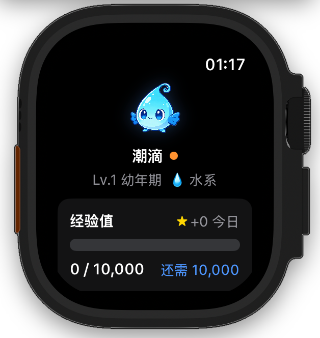

# 🐾 CaloriePet · 卡路里宠物

> **让运动变成养宠游戏** —— 你的每一步，都在喂养一只等待你的小宠物。

[]()
[]()
[]()

---

## ✨ 这是什么？

CaloriePet 是一个**把健康数据变成宠物养成游戏**的开源项目。

它做了三件简单但有趣的事：

1. 📊 **读取你的运动数据**（通过 Apple HealthKit）
2. 🎮 **把数据变成经验值**（卡路里 × 1 + 步数 × 0.1）
3. 🐣 **喂养一只虚拟宠物**（10种宠物，3段进化）

结果就是：你为了看宠物进化，会主动想去走路 🚶‍♂️

---

## 🎬 效果预览



*一只水系宠物"潮滴"，从幼年期到完全体的成长过程*

---

## 🚀 快速开始

### 运行要求
- iOS 17+ / watchOS 10+
- Xcode 15+
- Apple Developer 账号（真机测试时需要）

### 安装步骤

```bash
# 1. 克隆项目
git clone https://github.com/Fermi-lin/CaloriePet.git

# 2. 用 Xcode 打开
open CaloriePet/CaloriePet.xcodeproj
```

3. 在 Xcode 中选择 iPhone + Watch 模拟器
4. 按 Cmd + R 运行

---

## 🎯 适合谁用？

### 👤 普通用户
- 想养电子宠物，顺便督促自己运动
- 有 Apple Watch，想让它更有趣
- 喜欢宝可梦、拓麻歌子这类养成游戏

### 👨‍💻 开发者学习
这是一个**完整的 SwiftUI + WatchOS 学习案例**：

| 技术点 | 文件位置 |
|-------|---------|
| HealthKit 集成 | `Shared/HealthKitManager.swift` |
| iPhone-Watch 同步 | `Shared/WatchConnectivityManager.swift` |
| 游戏化系统 | `Shared/Pet.swift`, `Shared/PetViewModel.swift` |
| 跨平台 UI | `iPhone/ContentView.swift`, `Watch/ContentView_Watch.swift` |

### 🏢 游戏厂商/创业者
**拿这个框架，换套宠物图片，就是一个完整的内嵌小游戏。**

只需要：
1. 替换 `Assets.xcassets` 里的宠物图片（30张：10家族 × 3等级）
2. 修改 `Pet.swift` 里的家族定义
3. 调整经验值公式

就能快速上线一个"运动养宠"功能模块。

---

## 🏗️ 项目结构
```
CaloriePet/ 
├── 📁 Shared/ # 核心逻辑（iOS + Watch 共用） 
│ ├── Pet.swift # 宠物模型、家族定义、进化系统 
│ ├── PetViewModel.swift # 业务逻辑、经验值计算 
│ ├── HealthKitManager.swift # 健康数据读取 
│ └── WatchConnectivityManager.swift # 双端同步 
├── 📁 iPhone/ # iPhone 专属 UI 
│ └── ContentView.swift 
├── 📁 Watch/ # Apple Watch 专属 UI 
│ └── ContentView_Watch.swift 
└── 📁 CaloriePet/ # 项目配置
```

---

## 🎨 自定义宠物（5分钟教程）

想换成自己的宠物形象？超简单：

**Step 1：准备图片**
- 命名规则：`家族名_lv1.png`, `家族名_lv2.png`, `家族名_lv3.png`
- 例如：`flamepaw_lv1.png`, `flamepaw_lv2.png`, `flamepaw_lv3.png`

**Step 2：添加到项目**
- 拖到 Xcode 的 `Assets.xcassets` 里

**Step 3：修改 Pet.swift**
```swift
enum PetFamily: String, Codable, CaseIterable {
    case flamepaw = "flamepaw"   // 你的新宠物
    // ... 其他家族
    
    var chineseName: String {
        switch self {
        case .flamepaw: return "焰爪"   // 中文名
        // ...
        }
    }
    
    var element: String {
        switch self {
        case .flamepaw: return "🔥 火系"   // 属性
        // ...
        }
    }
}
```

Done！重新运行就能看到你的宠物了。

---

## 🎮 核心玩法

### 经验值公式
XP = 卡路里(千卡) × 1.0 + 步数 × 0.1


### 进化阶段
| 等级 | 名称 | 所需 XP |
|-----|------|--------|
| Lv.1 | 幼年期 | 0 → 10,000 |
| Lv.2 | 成长期 | 10,000 → 30,000 |
| Lv.3 | 完全体 | 30,000（满级）|

### 10 个宠物家族
🔥 焰爪（火）| 💧 潮滴（水）| 🌱 萌芽（草）| ⚡ 电灵（电）| ❄️ 霜灵（冰）
🌪️ 风灵（风）| 🪨 岩仔（岩）| ☀️ 辉石（光）| 🌙 月影（暗）| 🍄 荧光（妖精）


---

## 🔒 隐私说明

- ✅ 所有数据存储在本地，**不上传任何服务器**
- ✅ 使用 Apple HealthKit，遵循苹果隐私规范
- ✅ 无广告、无追踪、无内购

---

## 🛠️ 技术栈

- **Swift 5.9**
- **SwiftUI** - 跨平台 UI 框架
- **HealthKit** - 健康数据读取
- **WatchConnectivity** - 双端数据同步
- **UserDefaults + App Groups** - 数据持久化

---

## 🤝 贡献指南

欢迎提交 PR！特别是：

- 🎨 新的宠物设计
- ✨ 新的进化动画
- 🌍 多语言支持
- 🐛 Bug 修复

---

## 📄 许可

MIT License — 你可以自由使用、修改、商用，只需要保留版权声明。

---

## 🙏 致谢

- 宠物图片由 [Raphael AI](https://raphael.app) 生成
- 灵感来自 Tamagotchi、Pokémon、Finch

---

**⭐ 如果这个项目对你有帮助，请点个 Star！**

**🏃‍♂️ 现在就开始，让你的宠物进化吧！**
